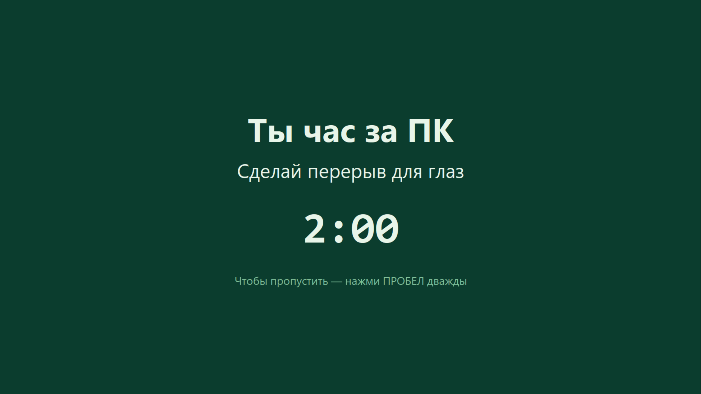
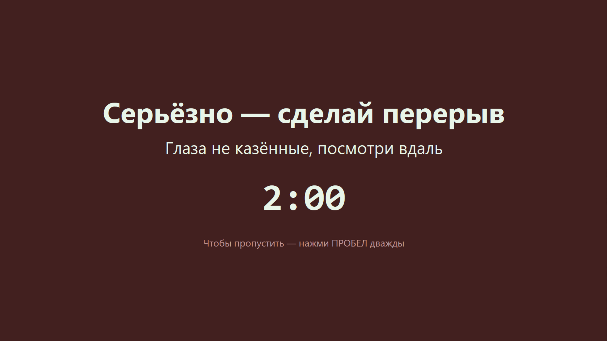

# EyeBreak — напоминалка о перерывах для глаз 👁️

Маленькая Windows-утилита, которая раз в час глушит весь экран тёмной плашкой
и заставляет оторваться от монитора. Чтобы глаза не «вытекали» после бесконечного
сидения за ПК.



## About

Когда залипаешь за компом, про перерывы забываешь напрочь. EyeBreak решает это в лоб:
раз в час перекрывает экран на пару минут зелёной плашкой с обратным отсчётом — и пока
он не дотикает до нуля, перерыв не считается пройденным. Если попытаться смахнуть его и
продолжить работать, программа возвращается **настойчивее** (красная плашка) каждые
10 минут, пока ты реально не отдохнёшь. А если ты просто отошёл от компа — она это видит
по бездействию мыши/клавиатуры и не пристаёт.

Без внешних зависимостей, без интернета, без телеметрии — чистый Python + WinAPI.

## Скриншоты

| Обычный перерыв | Настойчивое напоминание (после скипа) |
|---|---|
|  |  |

## Как это работает

- **Раз в час** экран глушится тёмно-зелёной плашкой с обратным отсчётом `2:00`.
- **Перерыв засчитан**, только если плашку не скипали до конца отсчёта (по умолчанию 2 минуты) —
  за это время глаза успевают отдохнуть.
- **Скип — двойной пробел** (одиночное нажатие не закрывает, чтобы не смахнуть случайно).
- Если перерыв скипнули, а за компом **продолжается активность** (ввод с клавиатуры или
  движения мышью), плашка возвращается **настойчивее каждые 10 минут** — уже красная.
- Если ты **отошёл** (нет активности дольше минуты) — программа считает, что глаза и так
  отдыхают, и не долбит.

## Запуск

### Вариант 1 — готовый EXE (ничего ставить не надо)

Скачай [`EyeBreak.exe`](EyeBreak.exe) и запусти. Окна не будет — программа висит в фоне
и сама покажет плашку через час.

### Вариант 2 — из исходника

Нужен только Python 3.8+ под Windows (всё остальное — стандартная библиотека):

```bash
python eye_break.py
```

Интервал основного цикла можно задать аргументом в минутах:

```bash
python eye_break.py 30
```

## Настройки

Все параметры — константы в начале `eye_break.py`:

| Параметр | По умолчанию | Что значит |
|---|---|---|
| `INTERVAL_MIN` | `60` | как часто показывать перерыв (минут) |
| `NAG_MIN` | `10` | как часто долбить, если перерыв скипнули (минут) |
| `REST_SECONDS` | `120` | длина отсчёта = сколько надо отдыхать, чтобы перерыв засчитался (сек) |
| `AWAY_SECONDS` | `60` | тишина дольше этого = «человек отошёл», не долбим (сек) |
| `BG_COLOR` / `BG_COLOR_NAG` | зелёный / бордовый | цвета фона обычной и настойчивой плашек |

## Автозапуск вместе с Windows

Положи ярлык на `EyeBreak.exe` в папку автозагрузки. Открыть её:

```
Win+R  →  shell:startup  →  Enter
```

и закинь туда ярлык.

## Сборка EXE из исходника

```bash
pip install pyinstaller
pyinstaller --onefile --windowed --name EyeBreak eye_break.py
```

Готовый файл появится в `dist/EyeBreak.exe`.

## Требования

- **Windows** (используется WinAPI: DPI-awareness и idle-таймер `GetLastInputInfo`).
- Для запуска из исходника — **Python 3.8+**. EXE самодостаточен.

## Лицензия

[MIT](LICENSE) — делай что хочешь.
